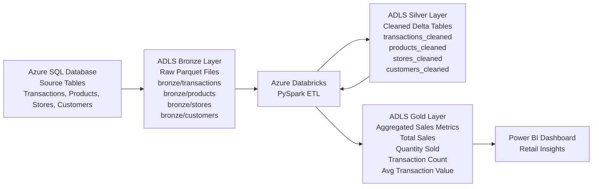

**Project Overview**

This project implements an end-to-end retail data pipeline using the Medallion Architecture (Bronze, Silver, Gold) on Azure. Transactional retail data stored in Azure SQL Database is ingested into Azure Data Lake Storage (ADLS) and processed using Azure Databricks with PySpark.

The pipeline performs schema enforcement, data cleaning, duplicate removal, and multi-table joins to create curated datasets. Aggregated business metrics such as total sales, quantity sold, transaction count, and average transaction value are generated in the Gold layer and visualized through Power BI dashboards for business insights.
## Retail Data Pipeline Architecture

**Tech Stack:**

Cloud Platform

Microsoft Azure

Data Storage

Azure SQL Database (Source System)

Azure Data Lake Storage Gen2 (Bronze, Silver, Gold layers)

Processing Engine

Azure Databricks

PySpark

Data Formats

Parquet (Raw data storage)

Delta Lake (Silver and Gold curated datasets)

Data Transformation

PySpark DataFrame API

Multi-table joins

Aggregations

Data cleaning and deduplication

Visualization

Power BI

**Pipeline Steps:**
1. Data Ingestion

Created retail source tables (transactions, products, stores, customers) in Azure SQL Database.

Ingested data into ADLS Bronze Layer and stored it as raw Parquet files.

2. Data Processing (Silver Layer)

Used Azure Databricks (PySpark) to read raw data from the Bronze layer.

Performed schema enforcement, type casting, and duplicate removal.

Joined transaction, product, store, and customer datasets to create a clean analytical dataset.

Stored the processed data in ADLS Silver Layer using Delta format.

3. Data Transformation (Gold Layer)

Generated aggregated business metrics including:

Total Sales

Quantity Sold

Number of Transactions

Average Transaction Value

Saved the aggregated dataset as Delta tables in the Gold layer.

4. Data Visualization

Connected Power BI to Databricks Delta tables.

Built interactive dashboards showing sales distribution by store, location, category, and product.

