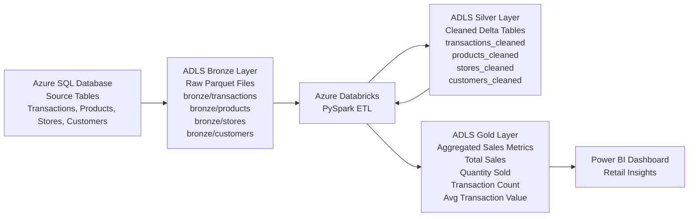

## Retail Data Pipeline Architecture

```mermaid
flowchart LR

A[Azure SQL Database<br>Source Tables<br>Transactions, Products, Stores, Customers]

B[ADLS Bronze Layer<br>Raw Parquet Files<br>bronze/transactions<br>bronze/products<br>bronze/stores<br>bronze/customers]

C[Azure Databricks<br>PySpark ETL]

D[ADLS Silver Layer<br>Cleaned Delta Tables<br>transactions_cleaned<br>products_cleaned<br>stores_cleaned<br>customers_cleaned]

E[ADLS Gold Layer<br>Aggregated Sales Metrics<br>Total Sales<br>Quantity Sold<br>Transaction Count<br>Avg Transaction Value]

F[Power BI Dashboard<br>Retail Insights]

A --> B
B --> C
C --> D
D --> C
C --> E
E --> F
```
